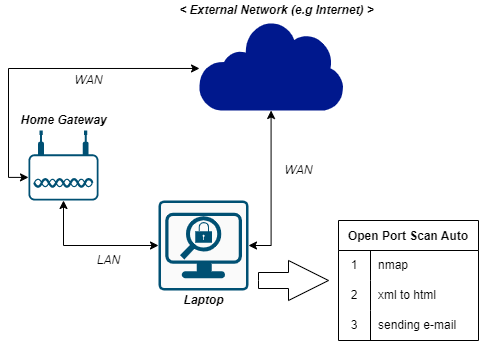

# Open Port Scanning Automation
## Purpose
Nmap(https://nmap.org/) is a well known tool to scan open ports for like home gateway products. This tool is simple to use but results which this tool makes is xml format. XML is not easy to read when it compares to html so the results made from Nmap have low readablitiy.
To overcome this inconvinience, I tried to use lxml package to convert xml format to html. And windows batch has also used to remove the other inconvinience to execute nmap using the combination of multi options like TCP, UDP, IPv4, IPv4, LAN, WAN. Plus let all html converted files send through e-mail to check the results after overnight execution

## Used major technique
- Python 3
- lxml (to convert xml to html)
- Windows batch

## Simple Diagram and Sequences
- Diagram

    
     
    

- Sequences
  - 1st. Execution nmap with the combination of each option
   > TCP, IPv4, LAN
   > UDP, IPv4, LAN
   > TCP, IPv6, LAN
   > UDP, IPv6, LAN
   > TCP, IPv4, WAN
   > UDP, IPv4, WAN
   > TCP, IPv6, WAN
   > UDP, IPv6, WAN 
  - 2nd. After finishing nmap executions, the results will be created as xml
  - 3rd. These xml results are going to be converted to html using lxml package.
  - 4th. The files converted to html will be sent to the target e-mail address using a simple python code. (End)
